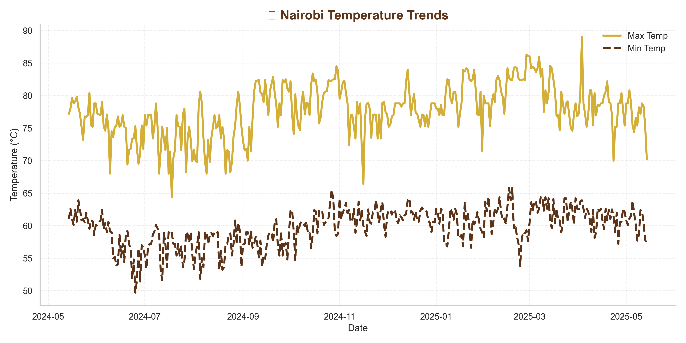
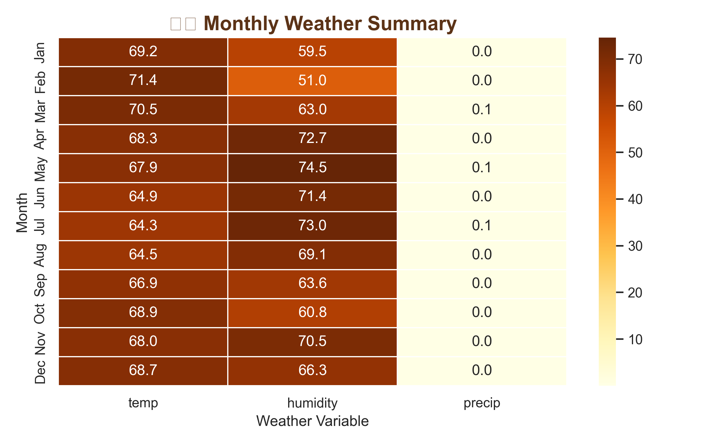

# Nairobi Weather Analysis (May 2024 – May 2025) 🌦️🌞

An elegant data analysis project exploring Nairobi's weather patterns using **Python**, **Pandas**, **Matplotlib**, and **Seaborn**.  
The project visualizes temperature trends, rainfall, humidity, and monthly summaries through **beautiful, professional charts**.

---

## 📂 Project Structure

kenya_weather_analysis/
│

├── data/ # CSV datasets (Nairobi weather 2024-2025)

├── outputs/ # All saved visualizations (PNG)

├── Kenya_Weather_Analysis.ipynb # Main analysis notebook

├── README.md

└── requirements.txt # Python dependencies

yaml

Copy code

---

## 📊 Key Visuals

### 1. Temperature Trends
- Shows daily maximum and minimum temperatures.
- Max temperature peaks in **February**.
- Coolest periods in **July**.  



---

### 2. Rainfall & Humidity Trends
- Shows daily rainfall (mm) and humidity (%) patterns.
- Highest rainfall observed in **April**.
- Humidity closely follows rainfall trends.


---

### 3. Monthly Summary Heatmap
- Average monthly **temperature**, **humidity**, and **precipitation**.
- Shows seasonal patterns at a glance:
  - May–Jun: moderate temperatures and rainfall
  - Jul–Aug: coolest months, lower rainfall
  - Oct–Nov: short rains period, moderate rainfall
  - Dec–Jan: warmer, drier months



---

## 🛠️ Tools & Libraries
- Python 3.x  
- Pandas  
- Matplotlib  
- Seaborn  

---

## ✅ Insights Summary
- Temperature peaks in **February** and coolest in **July**.  
- Rainfall highest in **April**; humidity peaks with rainfall.  
- Seasonal patterns are visible in monthly heatmap.

---

## 📈 How to Run
1. Clone the repository:  
```bash
git clone <YOUR_REPO_URL>
Create & activate a virtual environment:

bash
Copy code
python -m venv venv
source venv/bin/activate  # or venv\Scripts\activate on Windows
Install dependencies:

bash
Copy code
pip install -r requirements.txt
Open Kenya_Weather_Analysis.ipynb in JupyterLab or Jupyter Notebook and run all cells.
